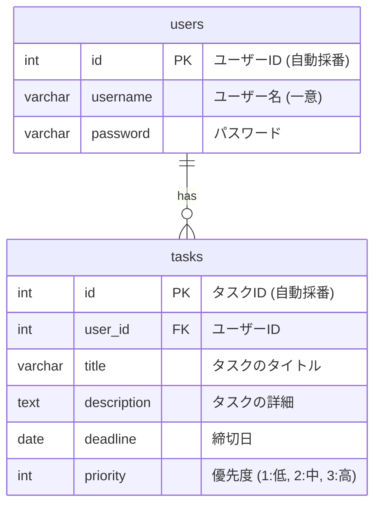
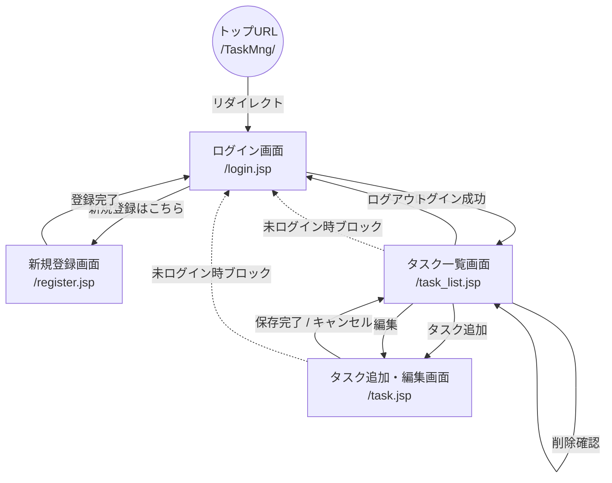

# タスク管理アプリ（TaskMng）

## ■ 概要
Java (Servlet/JSP) で作成した、個人向けのタスク管理Webアプリケーションです。
セキュアなログイン認証から、タスクのCRUD（作成・読み取り・更新・削除）処理まで、Webアプリケーションの基本となる機能を網羅して実装しています。

## ■ アプリの目的
日々のタスクを直感的に管理し、優先度や期限を可視化するために作成しました。
また、自身のJava/Webアプリケーション開発スキルの証明と、モダンな開発フロー（MVCモデル、Maven管理）の学習を目的としています。

## ■ 画面イメージ
（※完成したアプリのスクリーンショット画像や、YouTubeにアップした動画のURLなどをここに記載してください）
* [YouTube：動作デモ動画はこちら](動画のURL)

## ■ ER図・画面遷移
### ER図
データベースのテーブル設計です。ユーザー（1）に対して、タスク（多）が紐づく関係性（1対多）になっています。



### 画面遷移図
MVCアーキテクチャに基づき、各画面へのアクセスはサーブレットを経由し、未ログイン状態でのタスク画面へのアクセスはブロックする設計としています。



## ■ 機能一覧
* **ユーザー認証機能**
  * 新規ユーザー登録 / ログイン / ログアウト機能
  * 未ログインユーザーのアクセス制御（セッション管理）
* **タスク管理機能**
  * タスクの新規登録・一覧表示・編集・削除
  * 優先度（高・中・低）のバッジ表示機能
  * エラー時の入力値保持機能（UI/UX向上）

## ■ 技術スタック
* **バックエンド**: Java 17, Servlet API (Jakarta EE), JSP, JSTL
* **フロントエンド**: HTML5, Bootstrap 5
* **データベース**: H2 Database (インメモリ/ファイルベース)
* **ビルドツール**: Maven
* **動作環境**: Apache Tomcat 10

## ■ 工夫した点
**① モダンなアーキテクチャとセキュリティ対策**
JSPファイルを `WEB-INF` 内に配置することで直接アクセスを遮断し、堅牢なMVCアーキテクチャを実現しました。また、XSS（クロスサイトスクリプティング）対策としてのHTMLエスケープや、SQLインジェクションを防ぐ `PreparedStatement` の徹底など、実務を意識したセキュアな実装を行っています。

**② 生成AIを活用した開発プロセス**
開発効率の向上とモダンなコード作法の学習のため、生成AIを「技術的な壁打ち相手・コードレビューアー」として活用しました。単なるコード生成に留まらず、「なぜこの設計が適切か」「例外処理のベストプラクティスは何か」をAIと議論しながら実装することで、深いレベルでの技術理解に繋げています。

**③ UI/UXへの配慮**
エラー発生時に単にメッセージを出すだけでなく、ユーザーが入力しかけたデータを保持して画面を再描画する仕組みを取り入れ、ユーザーの入力ストレスを軽減する設計にしました。

## ■ セットアップ・起動方法
本アプリはMavenで依存関係を管理しているため、簡単に環境を構築できます。

```bash
# 1. リポジトリのクローン
git clone [https://github.com/8k4gwptjh9-png/TaskMng.git](https://github.com/8k4gwptjh9-png/TaskMng.git)
cd TaskMng

# 2. Eclipse等へのインポートとビルド
Eclipseの「ファイル」>「インポート」>「既存のMavenプロジェクト」から読み込んでください。
必要なライブラリ（H2, JSTL等）はpom.xml経由で自動ダウンロードされます。

# 3. データベースの準備（H2コンソール等で実行）
src/main/resources/schema.sql（※作成したテーブル定義のSQLをここに記載するか、ファイルとして置いておきます）を実行し、テーブルを作成します。

# 4. アプリの起動
Tomcat 10サーバーにプロジェクトを追加し、起動します。
ブラウザで以下のURLにアクセスしてください。
http://localhost:8080/TaskMng/